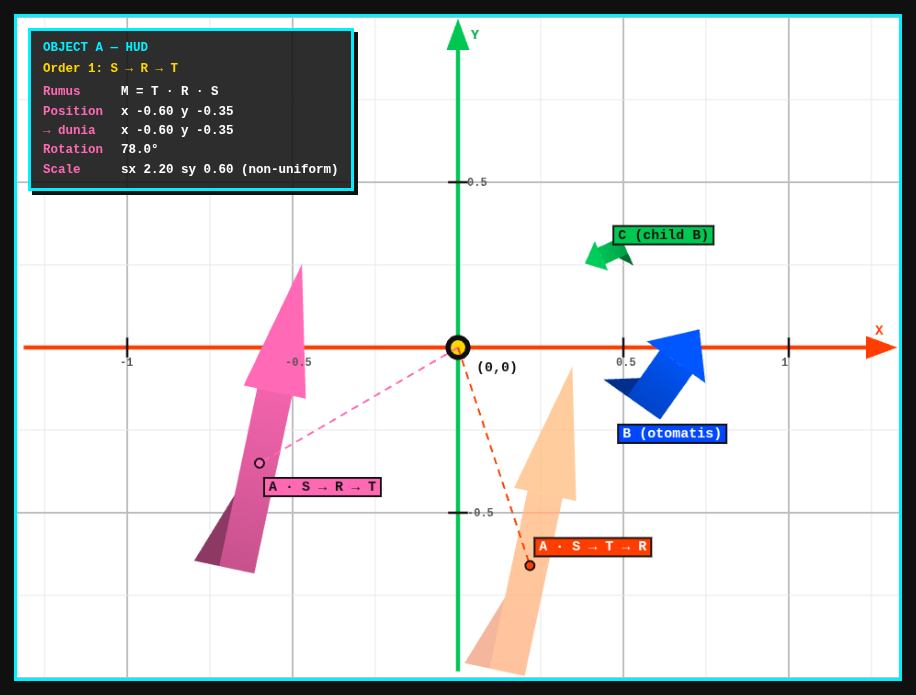

# Praktikum 3 — Interactive Transformation Playground

**EF234504 · Grafika Komputer · Transformation & Coordinate System dengan WebGL2**
Institut Teknologi Sepuluh Nopember (ITS) — Departemen Teknik Informatika

## Identitas Kelompok

**Kelompok Pemula**

| No | Nama | NRP |
|----|------|-----|
| 1 | Nabilah Bunga Sulistia | 5025241073 |
| 2 | Callista Fidelya Roba Gultom | 5025241086 |

## Deskripsi Aplikasi

Aplikasi WebGL2 interaktif untuk menerapkan **translation, rotation, uniform scaling, non-uniform scaling**, dan **komposisi Model Matrix 3×3**.

- Geometry (bentuk panah) dibuat **sekali** dalam *local coordinate* dan disimpan di **satu vertex buffer (VAO)** yang dipakai ulang oleh tiga objek. Data vertex tidak pernah diubah.
- Posisi, rotasi, dan ukuran dibentuk hanya oleh Model Matrix `mat3` yang dikirim ke vertex shader sebagai uniform `u_model` (`gl.uniformMatrix3fv`). Uniform `u_view` hanya mengoreksi aspect ratio.
- **Object A (pink)** — dikontrol keyboard secara kontinu (state-based input + `deltaTime`) dan mouse.
- **Object B (biru)** — animasi otomatis: rotation kontinu + scaling berdenyut.
- **Object C (hijau)** — child dari B (parent–child) yang mengorbit dan berputar sendiri.
- **HUD** menampilkan position, rotation, scale, dan transform order aktif (juga posisi dunia, preset, FPS, dan koordinat mouse).
- **Sumbu X (merah), sumbu Y (hijau), grid, dan origin (0,0)** digambar di scene.

## Daftar Kontrol

| Kontrol | Fungsi |
|---------|--------|
| `←` `↑` `↓` `→` | Translation Object A |
| `Q` / `E` | Rotation (berlawanan / searah jarum jam) |
| `+` / `−` | Uniform scale |
| `Z` / `X` | Scale X (kecil / besar) |
| `C` / `V` | Scale Y (kecil / besar) |
| `R` | Reset transform |
| `T` | Toggle transform order |
| `1` `2` `3` | Transform preset |
| Klik / drag mouse di canvas | Translation Object A dengan mouse |
| `H` | Tampilkan / sembunyikan bayangan order lawan |
| `P` | Aktifkan / matikan parent–child (Object C) |

Dropdown *Frame rate* pada halaman membatasi render ke 30 atau 15 FPS untuk menguji bahwa gerak tetap konsisten.

## Transform Order yang Dibandingkan

Kedua urutan memakai parameter yang sama (translation, rotation, scale). Object A digambar dengan order aktif (pink) dan order lawan (bayangan oranye).

| Order | Rumus | Efek |
|-------|-------|------|
| 1: Scale → Rotate → Translate | `M = T · R · S` | Objek berputar/berskala terhadap pusatnya sendiri, lalu dipindahkan |
| 2: Scale → Translate → Rotate | `M = R · T · S` | Objek dipindahkan lalu diputar terhadap origin (0,0), sehingga mengorbit |

## Fitur Pilihan yang Dikerjakan

1. Reset transform dengan tombol `R`
2. Tiga transform preset (`1`, `2`, `3`)
3. Toggle transform order (`T`)
4. Translation menggunakan mouse
5. Parent–child transformation dengan simple orbit (Object C mengikuti Object B)

## Petunjuk Menjalankan

Tidak ada dependency dan tidak ada proses build.

1. Clone atau unduh repository ini.
2. Buka `index.html` langsung di browser modern yang mendukung WebGL2 (Chrome, Edge, atau Firefox terbaru).

Alternatif dengan server lokal (PowerShell):

```powershell
cd praktikum-03
python -m http.server 8000
# lalu buka http://localhost:8000
```

## Struktur Repository

```
praktikum-03/
├── index.html
├── style.css
├── main.js
├── matrix3.js
├── README.md
└── screenshot.png
```

## Screenshot



## Link Video Demo

<!-- GANTI dengan link video demo kelompok -->
Video demo: **ISI_LINK_VIDEO_DEMO_DI_SINI**

## Link Repository

Repository GitHub: **ISI_LINK_REPOSITORY_DI_SINI**
